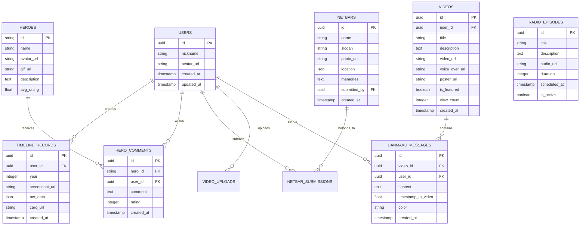

# DOTA怀旧网站技术架构文档

## 1. Architecture design


## 2. Technology Description

- Frontend: React@18 + TypeScript + Tailwind CSS + Vite
- Backend: Node.js + Express@4 + TypeScript
- Database: Supabase (PostgreSQL)
- File Storage: Supabase Storage
- Real-time: Supabase Realtime (WebSocket)

## 3. Data Service

- Supabase: 用户数据存储、实时弹幕、文件存储
- OCR服务: 百度OCR API或腾讯云OCR (战绩截图识别)
- 地图服务: 高德地图API (网吧热力图)
- 音频服务: Web Audio API (音频播放和可视化)

## 4. API definitions

### 4.1 Core API

#### 用户战绩相关
```
POST /api/timeline/upload-screenshot
```

Request:
| Param Name | Param Type | isRequired | Description |
|------------|------------|------------|-------------|
| year | number | true | 年份 |
| image | File | true | 战绩截图文件 |
| description | string | false | 描述信息 |

Response:
| Param Name | Param Type | Description |
|------------|------------|-------------|
| success | boolean | 上传状态 |
| data | object | OCR识别结果 |
| cardUrl | string | 生成的战绩卡片URL |

#### 英雄评价相关
```
POST /api/heroes/comment
```

Request:
| Param Name | Param Type | isRequired | Description |
|------------|------------|------------|-------------|
| heroId | string | true | 英雄ID |
| comment | string | true | 评价内容 |
| rating | number | true | 评分(1-5) |

Response:
| Param Name | Param Type | Description |
|------------|------------|-------------|
| success | boolean | 提交状态 |
| commentId | string | 评价ID |

#### 网吧档案相关
```
POST /api/netbar/submit
```

Request:
| Param Name | Param Type | isRequired | Description |
|------------|------------|------------|-------------|
| name | string | true | 网吧名称 |
| slogan | string | false | 网吧口号 |
| photo | File | false | 合照 |
| location | object | true | 位置信息 |
| memories | string | true | 回忆内容 |

Response:
| Param Name | Param Type | Description |
|------------|------------|-------------|
| success | boolean | 提交状态 |
| netbarId | string | 网吧档案ID |

#### 录像馆相关
```
POST /api/videos/upload
```

Request:
| Param Name | Param Type | isRequired | Description |
|------------|------------|------------|-------------|
| video | File | true | 视频/GIF文件 |
| title | string | true | 标题 |
| description | string | false | 描述 |
| voiceOver | File | false | 语音解说 |

Response:
| Param Name | Param Type | Description |
|------------|------------|-------------|
| success | boolean | 上传状态 |
| videoId | string | 视频ID |
| posterUrl | string | 分享海报URL |

#### 弹幕系统相关
```
POST /api/danmaku/send
GET /api/danmaku/list
```

#### 老兵电台相关
```
GET /api/radio/current
POST /api/radio/schedule
```

## 5. Server architecture diagram


## 6. Data model

### 6.1 Data model definition



### 6.2 Data Definition Language

#### 用户表 (users)
```sql
-- 创建用户表
CREATE TABLE users (
    id UUID PRIMARY KEY DEFAULT gen_random_uuid(),
    nickname VARCHAR(50) NOT NULL,
    avatar_url TEXT,
    created_at TIMESTAMP WITH TIME ZONE DEFAULT NOW(),
    updated_at TIMESTAMP WITH TIME ZONE DEFAULT NOW()
);

-- 创建索引
CREATE INDEX idx_users_nickname ON users(nickname);
```

#### 时间轴记录表 (timeline_records)
```sql
-- 创建时间轴记录表
CREATE TABLE timeline_records (
    id UUID PRIMARY KEY DEFAULT gen_random_uuid(),
    user_id UUID REFERENCES users(id) ON DELETE CASCADE,
    year INTEGER NOT NULL CHECK (year >= 2003 AND year <= 2024),
    screenshot_url TEXT,
    ocr_data JSONB,
    card_url TEXT,
    created_at TIMESTAMP WITH TIME ZONE DEFAULT NOW()
);

-- 创建索引
CREATE INDEX idx_timeline_records_user_id ON timeline_records(user_id);
CREATE INDEX idx_timeline_records_year ON timeline_records(year);
```

#### 英雄表 (heroes)
```sql
-- 创建英雄表
CREATE TABLE heroes (
    id VARCHAR(50) PRIMARY KEY,
    name VARCHAR(100) NOT NULL,
    avatar_url TEXT,
    gif_url TEXT,
    description TEXT,
    avg_rating DECIMAL(3,2) DEFAULT 0.00
);

-- 初始化英雄数据
INSERT INTO heroes (id, name, description) VALUES
('pudge', '屠夫', '经典钩子英雄，DOTA永恒的象征'),
('invoker', '祈求者', '十技能法师，操作天花板'),
('phantom_assassin', '幻影刺客', '暴击女王，一刀一个小朋友'),
('anti_mage', '敌法师', '后期核心，魔法克星'),
('crystal_maiden', '水晶室女', '团战大招，冰封千里');
```

#### 英雄评价表 (hero_comments)
```sql
-- 创建英雄评价表
CREATE TABLE hero_comments (
    id UUID PRIMARY KEY DEFAULT gen_random_uuid(),
    hero_id VARCHAR(50) REFERENCES heroes(id) ON DELETE CASCADE,
    user_id UUID REFERENCES users(id) ON DELETE CASCADE,
    comment TEXT NOT NULL,
    rating INTEGER CHECK (rating >= 1 AND rating <= 5),
    created_at TIMESTAMP WITH TIME ZONE DEFAULT NOW()
);

-- 创建索引
CREATE INDEX idx_hero_comments_hero_id ON hero_comments(hero_id);
CREATE INDEX idx_hero_comments_created_at ON hero_comments(created_at DESC);
```

#### 网吧档案表 (netbars)
```sql
-- 创建网吧档案表
CREATE TABLE netbars (
    id UUID PRIMARY KEY DEFAULT gen_random_uuid(),
    name VARCHAR(100) NOT NULL,
    slogan VARCHAR(200),
    photo_url TEXT,
    location JSONB NOT NULL,
    memories TEXT NOT NULL,
    submitted_by UUID REFERENCES users(id) ON DELETE SET NULL,
    created_at TIMESTAMP WITH TIME ZONE DEFAULT NOW()
);

-- 创建索引
CREATE INDEX idx_netbars_location ON netbars USING GIN(location);
CREATE INDEX idx_netbars_created_at ON netbars(created_at DESC);
```

#### 视频表 (videos)
```sql
-- 创建视频表
CREATE TABLE videos (
    id UUID PRIMARY KEY DEFAULT gen_random_uuid(),
    user_id UUID REFERENCES users(id) ON DELETE CASCADE,
    title VARCHAR(200) NOT NULL,
    description TEXT,
    video_url TEXT NOT NULL,
    voice_over_url TEXT,
    poster_url TEXT,
    is_featured BOOLEAN DEFAULT FALSE,
    view_count INTEGER DEFAULT 0,
    created_at TIMESTAMP WITH TIME ZONE DEFAULT NOW()
);

-- 创建索引
CREATE INDEX idx_videos_user_id ON videos(user_id);
CREATE INDEX idx_videos_is_featured ON videos(is_featured, created_at DESC);
CREATE INDEX idx_videos_view_count ON videos(view_count DESC);
```

#### 弹幕消息表 (danmaku_messages)
```sql
-- 创建弹幕消息表
CREATE TABLE danmaku_messages (
    id UUID PRIMARY KEY DEFAULT gen_random_uuid(),
    video_id UUID REFERENCES videos(id) ON DELETE CASCADE,
    user_id UUID REFERENCES users(id) ON DELETE CASCADE,
    content TEXT NOT NULL CHECK (LENGTH(content) <= 100),
    timestamp_in_video DECIMAL(10,3) NOT NULL,
    color VARCHAR(7) DEFAULT '#FFFFFF',
    created_at TIMESTAMP WITH TIME ZONE DEFAULT NOW()
);

-- 创建索引
CREATE INDEX idx_danmaku_video_timestamp ON danmaku_messages(video_id, timestamp_in_video);
```

#### 电台节目表 (radio_episodes)
```sql
-- 创建电台节目表
CREATE TABLE radio_episodes (
    id UUID PRIMARY KEY DEFAULT gen_random_uuid(),
    title VARCHAR(200) NOT NULL,
    description TEXT,
    audio_url TEXT NOT NULL,
    duration INTEGER NOT NULL,
    scheduled_at TIMESTAMP WITH TIME ZONE,
    is_active BOOLEAN DEFAULT FALSE,
    created_at TIMESTAMP WITH TIME ZONE DEFAULT NOW()
);

-- 创建索引
CREATE INDEX idx_radio_episodes_scheduled_at ON radio_episodes(scheduled_at DESC);
CREATE INDEX idx_radio_episodes_is_active ON radio_episodes(is_active, scheduled_at);

-- 初始化示例节目
INSERT INTO radio_episodes (title, description, audio_url, duration, is_active) VALUES
('老兵电台第一期', '回忆那些年我们一起玩过的DOTA', '/audio/episode_01.mp3', 360, true);
```